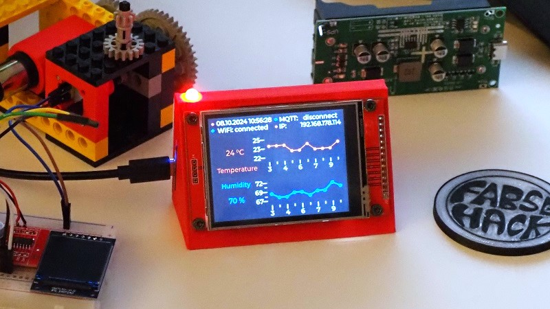
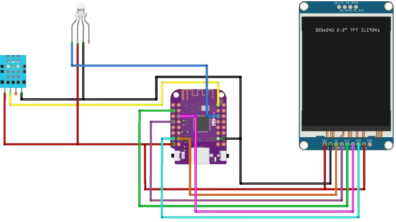
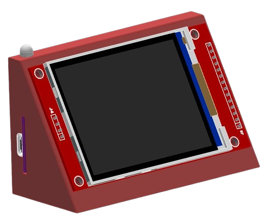
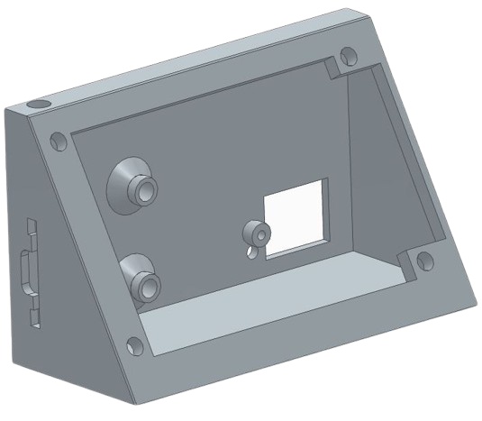
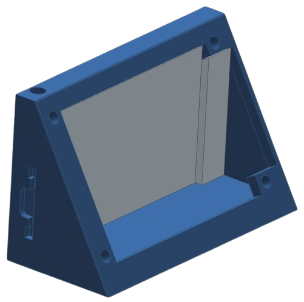

# Temperature and Humidity with MicroPython and LVGL
  
**Content:**  
- [Temperature and Humidity with MicroPython and LVGL](#temperature-and-humidity-with-micropython-and-lvgl)
- [Hardware](#hardware)
- [Project Description](#project-description)
- [Schematics](#schematics)
    - [Connections between ESP32-S2 Mini and ILI9341 Display:](#connections-between-esp32-s2-mini-and-ili9341-display)
    - [Connections between ESP32-S2 Mini and DHT11 Sensor:](#connections-between-esp32-s2-mini-and-dht11-sensor)
    - [Connection to Neopixel (LED):](#connection-to-neopixel-led)
- [Code](#code)
- [CAD Case](#cad-case)
    - [Instructions for 3D Printing](#instructions-for-3d-printing)
    - [Customization and Support](#customization-and-support)
- [To Do](#to-do)

# Hardware
- ILI9341 Display
- Lolin ESP32-S2 Mini
- DHT11 Sensor
- Neopixel LED (P9823)

# Project Description  
In this project, I'll explain how I built a temperature and humidity display using MicroPython and LVGL.

- **Building the Firmware:**  
  I checked out lvgl-micropython from [lvgl-micropython](https://github.com/lvgl/lv_micropython) and built the binary file for the ESP32-S2 Mini with the ILI9341 display. I'm not sharing the exact make command because the code is still under development and there are ongoing changes.

- **Wiring the ESP32-S2 Mini to the ILI9341 and DHT11:**  
  Proper connections were made between the ESP32-S2 Mini and the ILI9341 display, as well as the DHT11 sensor. You can refer to the `main.py` for the pin definitions.

- **Using Squareline Studio:**  
  I downloaded [Squareline Studio](https://squareline.io/). Although it's not recommended by the lvgl_micropython developers due to compatibility issues with the generated code, I used it and customized the code to fit the lvgl_micropython bindings from kdschlosser.

- **Additional Features:**  
  - **German Time:** The `German_time` class handles synchronization with an NTP server, including summer and winter time adjustments, though I'm not yet 100% satisfied with the solution.
  - **MQTT:** The project includes MQTT functionality. If you use Home Assistant, you can send the temperature and humidity measurements via MQTT to your MySQL database.
  - **WiFi Connection:** The code attempts to connect to your defined SSID and password. If unsuccessful, it opens an access point.
  - **Error Exceptions:** I've implemented "try/except" blocks in several places to handle errors, timeouts, or OS errors, and log error messages in the MicroPython REPL.
  - **Automatic Y-Axis Range Adjustments:** The Y-axis range in both diagrams adjusts automatically.
  - **Automatic X-Axis Range:** The X-axis range in both diagrams updates automatically (one step per hour).

# Schematics

and here is the fritzing file:
[schematics.fzz](schematics.fzz)

Here's the detailed schematic description in English, considering the specified pin connections for the ESP32-S2 Mini, ILI9341 display, and DHT11 sensor:

### Connections between ESP32-S2 Mini and ILI9341 Display:

- **VCC (ILI9341) -> 3.3V (ESP32-S2 Mini)**
  - Power supply for the display.
- **GND (ILI9341) -> GND (ESP32-S2 Mini)**
  - Common ground connection.
- **CS (ILI9341) -> Pin 15 (ESP32-S2 Mini)**
  - Chip Select for the display.
- **RESET (ILI9341) -> Pin 4 (ESP32-S2 Mini)**
  - Reset pin for the display.
- **DC (ILI9341) -> Pin 2 (ESP32-S2 Mini)**
  - Data/Command selection for the display.
- **SDI/MOSI (ILI9341) -> Pin 11 (ESP32-S2 Mini)**
  - Serial Data Input (MOSI).
- **SCK (ILI9341) -> Pin 7 (ESP32-S2 Mini)**
  - Serial Clock (SCK).
- **MISO (ILI9341) -> Pin 9 (ESP32-S2 Mini)**
  - (Optional, not always needed for SPI displays)
  
### Connections between ESP32-S2 Mini and DHT11 Sensor:

- **VCC (DHT11) -> 3.3V (ESP32-S2 Mini)**
  - Power supply for the sensor.
- **GND (DHT11) -> GND (ESP32-S2 Mini)**
  - Common ground connection.
- **DATA (DHT11) -> Pin 40 (ESP32-S2 Mini)**
  - Data line for temperature and humidity measurements.

### Connection to Neopixel (LED):

- **Data (Neopixel) -> Pin 36 (ESP32-S2 Mini)**
  - Data line to control the Neopixel.
  

# Code
The project uses asyncio for asynchronous programming. It includes:

- An LVGL-based UI
- A `German_time` class
- An MQTT class
- An asyncio `data_to_lvgl_every_hour` function
- An asyncio `data_to_lvgl_every_second` function
- `asyncio.gather` for running multiple coroutines concurrently
- Global variables
- Neopixel LED for status indication
- Exception handling for information logging

# CAD Case

Here is a photo of the full assempled project in CAD:  

  
This photos shows only the case:  

  
  
I provide CAD files in the following formats: `.par`, `.asm`, and `.stl`.

For 3D printing, I have included built-in support structures. You can slice it without additional support. The support structures are in the `.asm` (assembly) file.

Here are the direct download links:  
  
- assemply_files:
  - [case_with_supports](/CAD/assemply_files/case1_support.asm)
  
- par_files:
  - [only_case](/CAD/par_files/Case1.par)
  - [support1](/CAD/par_files/support1.par)
  - [support2](/CAD/par_files/support2.par)
  - [support3](/CAD/par_files/support3.par)
  
- stl_files:
  - [case_with_suppport](/CAD/stl_files/case1_support.stl)
  - [only_case](/CAD/stl_files/Case1.stl)
  - [support1](/CAD/stl_files/support1.stl)
  - [support2](/CAD/stl_files/support2.stl)
  - [support3](/CAD/stl_files/support3.stl)
  

### Instructions for 3D Printing
1. **Download the Files**: Use the provided links to download the necessary files in your preferred format.
2. **Review the Files**: Open the `.par` or `.asm` files in your CAD software to review the design. Make any necessary modifications as needed.
3. **Slicing the Model**: Import the `.stl` file into your slicing software. If you are using the file with built-in supports (`case_with_support.stl`), ensure that you disable additional support generation in your slicer settings.
4. **Print Settings**: Adjust your printer settings according to the material you are using. Common settings include layer height, infill density, and print speed. Refer to your 3D printer's manual for optimal settings.
5. **Print the Case**: Start the print job and monitor the process to ensure the print adheres well to the build platform and prints correctly.
6. **Assembly**: Once printed, remove the support structures carefully if using the support-included model. Assemble the ESP32-S2 Mini, ILI9341 display, and DHT11 sensor into the printed case.

### Customization and Support
These files should provide you with everything needed to review, modify, and print the case. If you have any questions or require further customization, please feel free to reach out!  
  
# To Do
- add blog entry to [fabse-hack](https://fabse-hack.github.io/)
- Create a YouTube video tutorial (unhappily, I didn't record the building process of this project)
