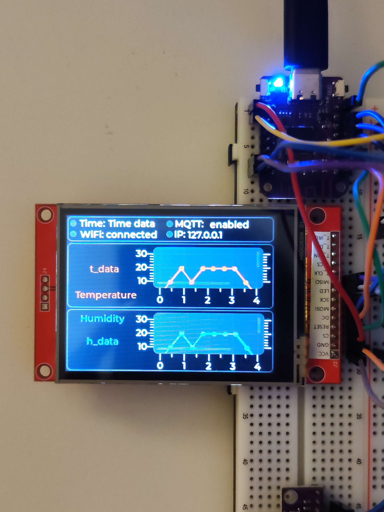

# Temperature and Humidity with Micropython and LVGL
  !!! STILL UNDER DEVELOPMENT !!!  
  
**Content:**  
[hardware](#hardware)  
[code](#code)  
[CAD_case](#CAD_case)  
[ToDo](#ToDo)
  
# Hardware
- ili9341  
- lolin esp32_s2_mini  
- DHT11  
- Neopixel LED (P9823)
  
  

  
# Project Description  
In this project, I'll explain how I built a temperature and humidity display using MicroPython and LVGL.  
  
- Building the Firmware:  
I checked out lvgl-micropython https://github.com/lvgl-micropython/lvgl_micropython and built the binary file for the ESP32-S2 Mini with the ILI9341 display. I'm not sharing the exact make command because the code is still under development and there are ongoing changes.  
  
- Wiring the ESP32-S2 Mini to the ILI9341 and DHT11:  
Proper connections were made between the ESP32-S2 Mini and the ILI9341 display. The DHT11 sensor wiring up too.  
  
- Using Squareline Studio:
I downloaded Squareline Studio https://squareline.io/. Although it's not recommended by the lvgl_micropython developers due to compatibility issues with the generated code, I used it and customized the code to fit the lvgl_micropython bindings from kdschlosser.
  
- Further Customizations:

  - Added functionalities like a clock, IP address display, MQTT, and WiFi status.   
  - Customized the temperature and humidity charts with automatic Y-Axis range adjustments (using set_total_tick_every, set_major_tick_every).
  

# Code
The project uses asyncio for asynchronous programming. It includes:

- An LVGL-based UI
- A German Time class
- An MQTT class
- An async def data_to_lvgl_every_hour function
- An async def data_to_lvgl_every_second function
- asyncio.gather for running multiple coroutines concurrently
- Main execution block
- (global) variables
- Neopixel LED for lightable status

# CAD_case

*.par and *.stl file from the case

# ToDo:
- Code is runnable but not yet finished (95%)
- Creating a YouTube video tutorial